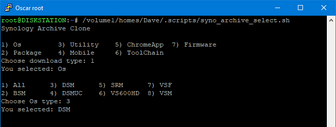
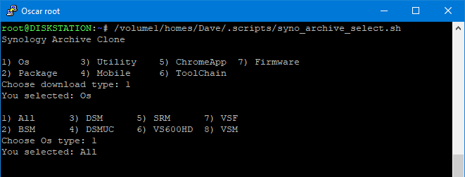
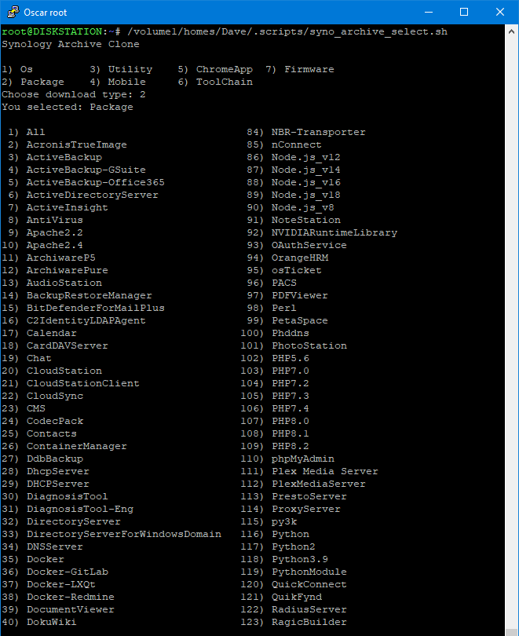
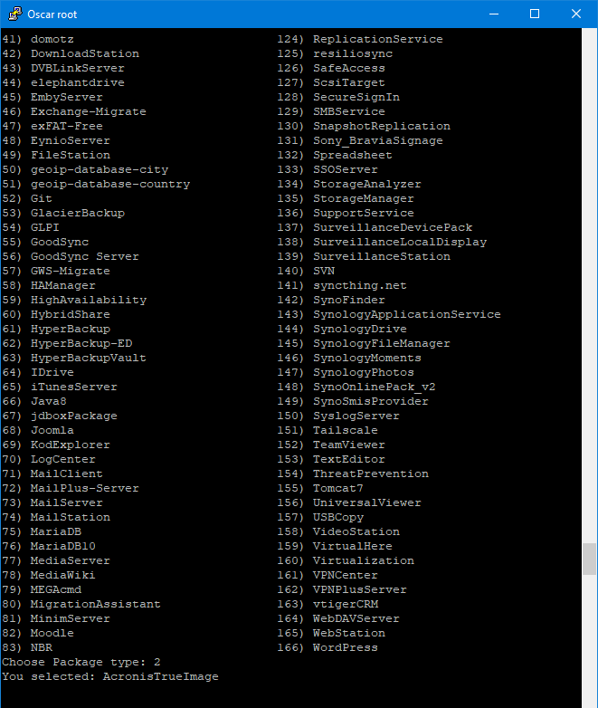
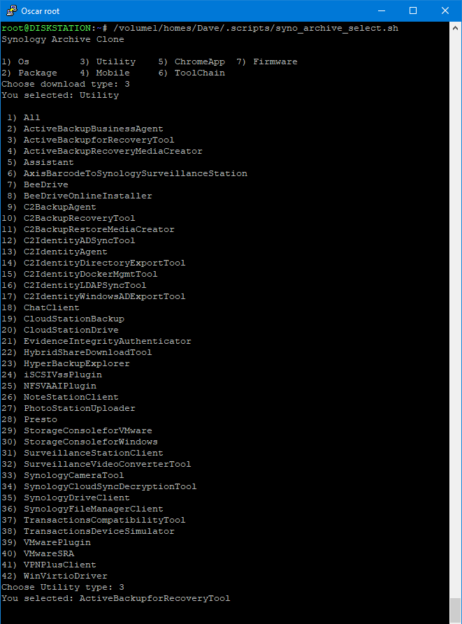
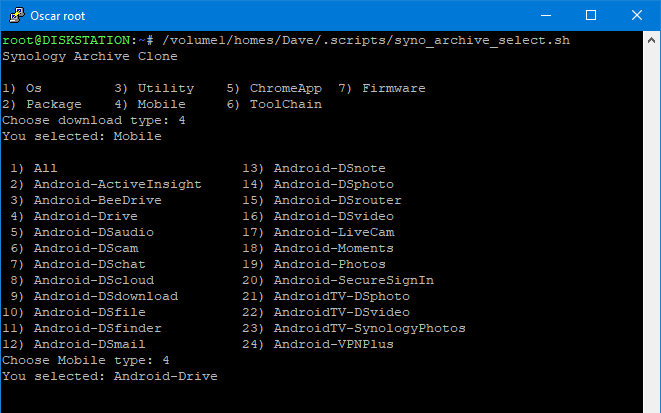
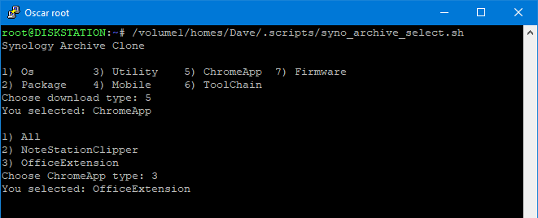
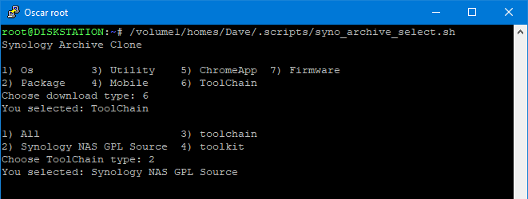
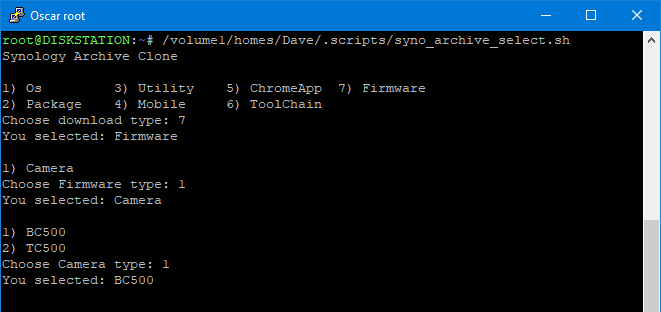

# Download Synology Archive

<a href="https://github.com/007revad/Download_Synology_Archive/releases"></a>
<a href="https://hits.seeyoufarm.com"></a>
[](https://github.com/sponsors/007revad)
[](https://user-badge.committers.top/australia/007revad)
<!-- [](https://user-badge.committers.top/australia_public/007revad) -->
<!-- [](https://user-badge.committers.top/australia_private/007revad) -->
<!-- [](https://github.com/007revad/Download_Synology_Archive/releases) -->

### Description

Easily download part or all of the Synology download archive

### Main php script

You can run syno_archive_clone.php directly. It needs 2 arguments.

```
Usage:
    clone.php <srcdir> <subdir>
    <subdir> can be All to download all in the <srcdir>
    Examples:
      php ./clone.php Os DSM
      php ./clone.php Os All
      php ./clone.php Package Docker
      php ./clone.php Package All
      php ./clone.php ToolChain toolkit
      php ./clone.php ToolChain "Synology NAS GPL Source"
```

**Logging the output**

If you want to log the output with the date and time:

    php ./clone.php 2>&1 | tee ./clone_$(date '+%Y%m%d-%H%M').log

**Requirements**

There is 1 variable you need to set so the script knows where you want it to download to:

    $destination = "/volume1/downloads/archive.synology.com";

**Credit**

clone.php is based on the excellent work at [github.com/stopforumspam/download-synology-dsm](https://github.com/stopforumspam/download-synology-dsm) <br>
Give them a star if you find this script useful or interesting.

<br>

### Bash launcher script

To make it easier to run clone.php there is also syno_archive_clone.sh which provides menus to select the available `<srcdir>` and `<subdir>` options. It then runs the php script with those options as arguments.

To run syno_archive_clone.sh

    ./syno_archive_clone.sh

**Requirements**

There are 3 variables you need to set so the script knows where the 2 php scripts are and where to save the log:

    php_script="/volume1/scripts/get_urls.php"
    
    php_script="/volume1/scripts/clone.php"
    
    php_log="/volume1/downloads/archive.synology.com/clone_$(date '+%Y%m%d-%H%M').log"

php_log can be blank `php_log=""` if you don't want anything logged. Or you can disable it by putting a # in front of it:

    #php_log="/volume1/downloads/archive.synology.com/clone_$(date '+%Y%m%d-%H%M').log"

<br>

**Bash launcher script screenshots**

<p align="leftr"></p>

<p align="leftr"></p>

<p align="leftr"></p>

<p align="leftr"></p>

<p align="leftr"></p>

<p align="leftr"></p>

<p align="leftr"></p>

<p align="leftr"></p>

<p align="leftr"></p>
