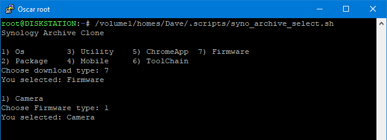

# Download Synology Archive
Download all or part of the Synology archive

### Main php script

You can run syno_archive_clone.php directly. It needs 2 arguments.

```
Usage:
    syno_archive_clone.php <srcdir> <subdir>
    <subdir> can be All to download all in the <srcdir>
    Examples:
      php ./syno_archive_clone.php Os DSM
      php ./syno_archive_clone.php Os All
      php ./syno_archive_clone.php Package Docker
      php ./syno_archive_clone.php Package All
      php ./syno_archive_clone.php ToolChain toolkit
      php ./syno_archive_clone.php ToolChain "Synology NAS GPL Source"
```

**Logging the output**

If you want to log the output with the date and time:

    php ./syno_archive_clone.php 2>&1 | tee ./clone_$(date '+%Y%m%d-%H%M').log

**Requirements**

There is 1 variable you need to set so the script knows where you want it to download to:

    $destination = "/volume1/downloads/archive.synology.com";

**Credit**

syno_archive_clone.php is based on the excellent work here: https://github.com/stopforumspam/download-synology-dsm <br>
Give them a star if you find this script useful or interesting.

<br>

### Bash launcher script

To make it easier to run syno_archive_clone.php there is also syno_archive_clone.sh which provides menus to select the available `<srcdir>` and `<subdir>` options. It then runs the php script with those options as arguments.

To run syno_archive_clone.sh

`./syno_archive_clone.sh`

**Requirements**

There are 2 variables you need to set so the script knows where the php script is and where to save the log:

    php_script="/volume1/scripts/syno_archive_clone.php"
    php_log="/volume1/downloads/archive.synology.com/clone_$(date '+%Y%m%d-%H%M').log"

php_log can be blank `php_log=""` if you don't want anything logged. Or you can disable it by putting a # in front of it:

    #php_log="/volume1/downloads/archive.synology.com/clone_$(date '+%Y%m%d-%H%M').log"

<br>

**Bash launcher script screenshots**

<p align="leftr"></p>

<p align="leftr"></p>

<p align="leftr"></p>

<p align="leftr"></p>

<p align="leftr"></p>

<p align="leftr"></p>

<p align="leftr"></p>

<p align="leftr"></p>

<p align="leftr"></p>
